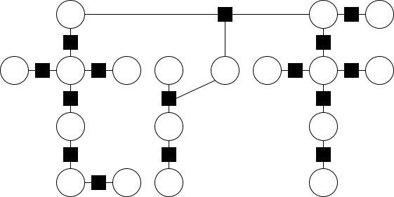

 

<!-- # torch_random_fields -->

`torch_random_fields` is a library for building markov random fields (MRF) with complex topology \[1\] \[2\] with `pytorch`, it is optimized for batch training on GPU. 

The key features include:

- Easy to plug into your research code
- Batch/GPU support for any random field with arbitary binary connections
- Fast training/inference with top-K logits, do not worry about too large label space

:star: Given a length-`100` linear-chain CRF (tested on my MacBook i7), you can achieve:
- **training**: up to `10` times speed up in the training stage with `pseudo-likelihood`, compared with `MLE`.
- **inference**: up to `2` times speed up with `mean field variational inference`, compared with Viterbi decoding.

## Cases

### Linear-Chain CRF

Check out the [tutorial](tests/test_linear_chain_crf.ipynb).

The well known linear-chain CRF which is heavily adopted in sequence labeling (POS-tagging, chunking, NER, etc.) is supported.

 

### Top-K Skip-Chain CRF

Check out the [tutorial](tests/test_skip_chain_crf.ipynb).

In `torch_random_fields`, any random field with arbitary topology is supported. To be more precise, we require binary connections, although in some case ternary connections are also supported (yes, I am lazy).

Here we show a case of Dynamic Skip-Chain CRF, where:

- Some nodes (e.g., two nodes with the same words) are connected, which looks **skipping** the linear connection \[3\]
- Only the **top-3** labels for each node are kept, greatly speeding up training and inference \[4\]

 

### Ising/Potts Model

Ising model (or Potts model) is widely used in statistical physics and computational biology \[5\]. In this case, the random variables form a grid, but it can be fully connected.

 

## Features

### Training

- **Linear-Chain CRF**: 
  - [x] maximum likelihood estimation
  - [x] structured perceptron
  - [x] piecewise training
  - [x] pseudo-likelihood
- **General CRF**: 
  - [x] structured perceptron
  - [x] piecewise training
  - [x] pseudo-likelihood

### Inference

- **Linear-Chain CRF**: 
  - [x] viterbi decoding
  - [x] **batch** loopy belief propagation
  - [x] **batch** mean field variational inference

- **General CRF**: 
  - [x] **batch** loopy belief propagation
  - [x] naive mean field variational inference
  - [ ] **batch** naive mean field inference

### Sampling

- Not implemented yet since I am lazy

## Acknowledgement

Some implementation borrows from these great projects with modifications:

- linear-chain crf: [pytorch-crf](https://github.com/kmkurn/pytorch-crf), [fairseq](https://github.com/facebookresearch/fairseq)
- loopy belief propagation: [pystruct](https://github.com/pystruct/pystruct)

## Reference

\[1\] [An Introduction to Conditional Random Fields](https://arxiv.org/abs/1011.4088) (Sutton and McCallum, 2010) 

\[2\] [Graphical Models, Exponential Families, and Variational Inference](https://people.eecs.berkeley.edu/~wainwrig/Papers/WaiJor08_FTML.pdf) (Wainwright and Jordan, 2008)

\[3\] [A Skip-Chain Conditional Random Field for Ranking Meeting Utterances by Importance](https://aclanthology.org/W06-1643/) (Galley, 2006)

\[4\] [Fast Structured Decoding for Sequence Models](http://papers.neurips.cc/paper/8566-fast-structured-decoding-for-sequence-models.pdf) (Sun, 2020)

\[5\] [Improved contact prediction in proteins: Using pseudolikelihoods to infer Potts models](https://arxiv.org/abs/1211.1281) (Ekeberg, 2013)